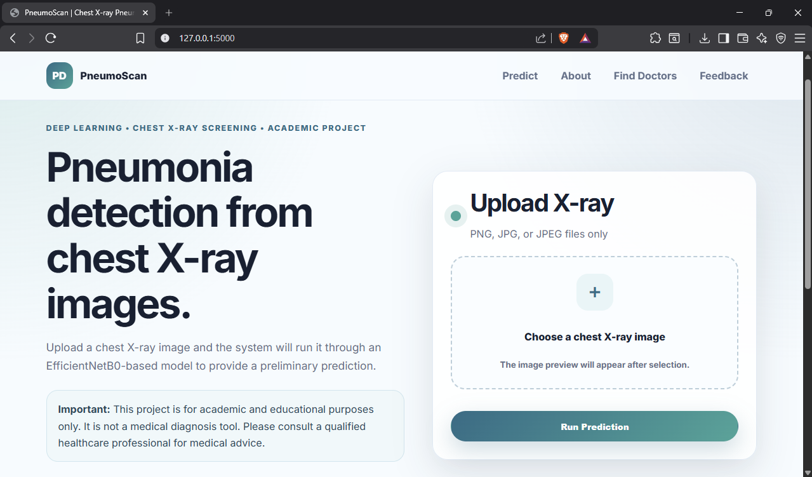
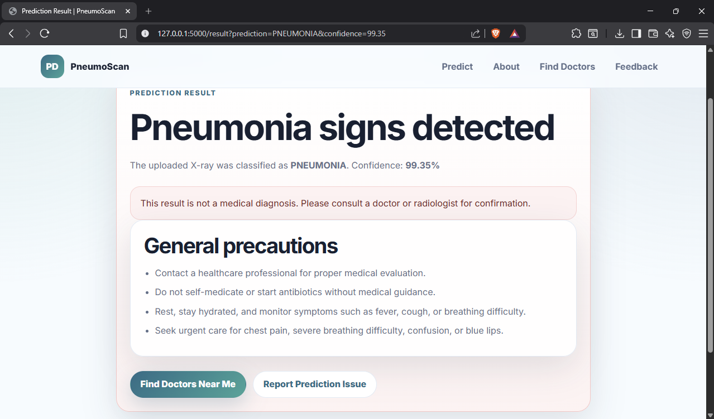

# PneumoScan: Pneumonia Detection Using EfficientNetB0

PneumoScan is a deep learning-based web application for preliminary pneumonia screening from chest X-ray images. The project uses an EfficientNetB0-based model integrated with a Flask web application, allowing users to upload a chest X-ray image and receive a prediction result as either **Normal** or **Pneumonia**.

This project was built as an academic healthcare AI application to demonstrate how a trained deep learning model can be connected with a user-friendly web interface, result explanation page, doctor search support, and feedback collection.

---

## Important Disclaimer

This project is for **academic and educational purposes only**. It is **not a medical diagnosis tool** and should not be used as a substitute for professional medical advice, diagnosis, or treatment.

Users should always consult a qualified healthcare professional, doctor, or radiologist for medical decisions.

---

## Project Overview

The main goal of this project is to classify chest X-ray images using deep learning and present the result through a simple web application.

The system allows users to:

- Upload a chest X-ray image
- Run the image through a trained EfficientNetB0 model
- View the prediction result
- Read general precautions if pneumonia signs are detected
- Search for nearby doctors or pulmonology specialists
- Submit feedback if the website or prediction does not work as expected

---

## Dataset

The model was trained using the **Chest X-Ray Images (Pneumonia)** dataset from Kaggle.

Dataset Link:

```text
https://www.kaggle.com/datasets/paultimothymooney/chest-xray-pneumonia
```

The dataset contains chest X-ray images categorized into **Normal** and **Pneumonia** classes, which were used for training and evaluating the deep learning model.

---

## Features

- Chest X-ray image upload
- Image preprocessing for model input
- Pneumonia prediction using EfficientNetB0
- Result page showing **Normal** or **Pneumonia**
- Confidence score display
- General precaution guidance when pneumonia signs are detected
- Doctor search support using Google Maps search links
- About page explaining the project in simple language
- Feedback page for reporting prediction or website issues
- Flask-based backend integration
- Clean and responsive front-end design

---

## Tech Stack

### Backend
- Python
- Flask
- TensorFlow / Keras
- NumPy
- Pillow
- Werkzeug

### Frontend
- HTML
- CSS
- JavaScript

### Model
- EfficientNetB0
- Convolutional Neural Networks
- Transfer Learning

### Tools
- Git
- GitHub
- VS Code
- Python Virtual Environment

---

## Model Details

The project involved comparing multiple deep learning models for chest X-ray classification, including:

- EfficientNetB0
- DenseNet121
- ResNet50
- VGG16

EfficientNetB0 was selected for the final web application because it showed strong performance during project evaluation and provided a good balance between accuracy and efficiency.

---

## Project Workflow

1. User uploads a chest X-ray image.
2. The Flask backend receives the uploaded image.
3. The image is resized to the model input size.
4. The trained EfficientNetB0 model predicts the class.
5. The application displays the result as **Normal** or **Pneumonia**.
6. If pneumonia is detected, the page shows general precautions and doctor search support.
7. Users can submit feedback if the prediction or website does not work as expected.

---

## File Structure

```text
pneumonia-detection-using-CNN/
│
├── app.py
├── requirements.txt
├── README.md
├── .gitignore
│
├── model/
│   └── new.h5
│
├── templates/
│   ├── base.html
│   ├── index.html
│   ├── result.html
│   ├── about.html
│   ├── doctors.html
│   └── feedback.html
│
├── static/
│   ├── css/
│   │   └── app.css
│   └── js/
│       └── app.js
│
├── uploads/
│   └── .gitkeep
│
├── docs/
│   └── project documents / publication files
│
├── sample_images/
│   └── sample X-ray images
│
└── screenshots/
    ├── home-page.png
    ├── result-normal.png
    ├── result-pneumonia.png
    ├── about-page.png
    └── feedback-page.png
```

---

## How to Run the Project

### 1. Clone the repository

```bash
git clone https://github.com/Varunch-16/pneumonia-detection-using-CNN.git
cd pneumonia-detection-using-CNN
```

### 2. Create a virtual environment

For Windows PowerShell:

```bash
py -3.11 -m venv venv
```

### 3. Install dependencies

```bash
.\\venv\\Scripts\\python.exe -m pip install -r requirements.txt
```

### 4. Add the trained model

Place the trained model file inside the `model` folder:

```text
model/new.h5
```

### 5. Run the Flask application

```bash
.\\venv\\Scripts\\python.exe app.py
```

### 6. Open the application

Open this URL in your browser:

```text
http://127.0.0.1:5000
```

---

## Requirements

```text
Flask==3.0.3
tensorflow==2.15.0
numpy==1.26.4
Pillow==10.3.0
Werkzeug==3.0.3
```

TensorFlow 2.15.0 is used for better compatibility with the saved `.h5` model file.

---

## Application Pages

### Home / Prediction Page

The home page allows users to upload a chest X-ray image and submit it for prediction.

### Result Page

The result page displays the model prediction. If the model predicts pneumonia, the page shows general precautions and a doctor search option.

### About Page

The about page explains the purpose of the project, model comparison, selected model, and project workflow in simple language.

### Find Doctors Page

This page provides Google Maps search links to help users find pulmonologists or respiratory specialists near their location.

### Feedback Page

The feedback page allows users to report issues if the website does not work properly or if the prediction seems incorrect.

---

## Publication

A research paper based on this project was published in the **International Journal of Research and Analytical Reviews (IJRAR)**.

**Title:** Pneumonia Detection in Chest X-ray Images Using EfficientNetB0  
**Journal:** International Journal of Research and Analytical Reviews  
**Volume/Issue:** Volume 11, Issue 2  
**Publication Date:** June 2024  
**Paper ID:** IJRAR24B3948  

---

## What I Did in This Project

In this project, I worked on both the machine learning and web application parts.

My work included:

- Preparing and training deep learning models for chest X-ray classification
- Comparing multiple CNN-based models
- Selecting EfficientNetB0 for the final prediction system
- Integrating the trained model with a Flask web application
- Building the image upload and prediction workflow
- Creating result pages for Normal and Pneumonia predictions
- Adding general precaution guidance for pneumonia results
- Adding doctor search support for users who want professional medical review
- Creating an About page to explain the project clearly
- Adding a Feedback page to collect user-reported issues
- Debugging model loading, dependency, and environment setup issues
- Writing documentation for setup, usage, and project explanation

---

## What I Learned

Through this project, I gained hands-on experience in:

- Medical image classification
- Deep learning model training and evaluation
- Transfer learning using EfficientNetB0
- Flask web application development
- Image upload and preprocessing workflows
- Connecting machine learning models with web applications
- Frontend design using HTML, CSS, and JavaScript
- Debugging Python environments and dependency issues
- Writing clear GitHub documentation
- Designing user-facing pages for non-technical users

---

## Future Improvements

- Add user authentication for saving prediction history
- Store prediction records in a database
- Add Grad-CAM visualization to highlight affected X-ray regions
- Improve doctor search using a real healthcare provider API
- Add deployment support using Render, AWS, or Azure
- Add unit tests for backend routes and prediction workflow
- Improve model explainability and validation
- Add a dashboard to track prediction and feedback history

---

## Screenshots
```markdown


```

---

## Author

**Sai Varun Chetrypally**  
M.S. Computing and Information Systems  
Youngstown State University  

GitHub: [https://github.com/Varunch-16](https://github.com/Varunch-16)  
LinkedIn: [https://www.linkedin.com/in/saivarunch](https://www.linkedin.com/in/saivarunch)

---

## License

This project is developed for academic and educational purposes.
